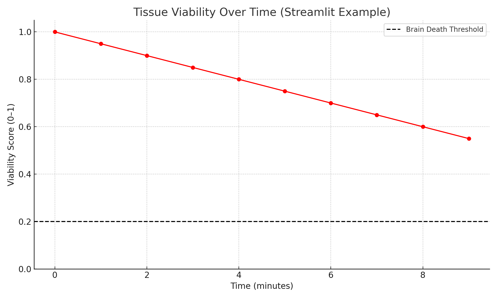

# 🧠 Digital Twin – Brain Perfusion & Ischemia Simulator

This project is part of a PhD dissertation focused on building digital twins of human organ systems. The brain model simulates perfusion, oxygen saturation, and tissue viability — predicting ischemia progression and the potential for brain death.

> Developed by Ihunna Amugo, DDS Candidate, MHA, MS, REHS

---

## 🔍 Project Overview

- Simulates viability decline across brain regions using synthetic perfusion data
- Flags ischemia risk and predicts brain death based on defined thresholds
- Interactive Streamlit app lets users simulate treatment and real-time outcomes
- Ideal for showcasing computational physiology, public health AI, and HPC medical modeling

---

## 📦 Features

- 🧪 Multiregional viability modeling with threshold-based alerts
- 📊 Time-series simulation with and without intervention
- 💬 Streamlit app for real-time user interaction
- 📁 Modular folder structure for reproducible portfolio presentation

---

## 🚀 Quick Start

1. Clone the repository:
```bash
git clone https://github.com/ihunnamatata/digital-twin-surgery.git
cd digital-twin-surgery
```

2. Install dependencies:
```bash
pip install -r requirements.txt
```

3. Launch the Streamlit app:
```bash
streamlit run app.py
```

4. Or explore the extended notebook:
```bash
notebooks/digital-twin-brain-extended-v2.ipynb
```

---

## 🖼️ Screenshots

### Simulation Output


### Streamlit App Example


---

## 📁 File Structure

- `data/` – Simulated perfusion and viability data
- `notebooks/` – Jupyter notebooks for analysis and modeling
- `output/` – Plots and simulation outputs
- `assets/` – App screenshots and portfolio visuals
- `app.py` – Streamlit app
- `requirements.txt` – Python dependencies

---

## 🧠 Project Scope

This project was developed as part of:
> *“Multiscale Computational Modeling of Immune-Driven Outcomes in Surgery and Transplantation: A Digital Twin Framework for Predictive Medicine”*

Research goals include:
- Fusion of FEM + PINNs for brain ischemia modeling
- Real-time simulation integration for surgical robotics
- High-performance computing across organ systems

---

## 👩🏾‍⚕️ Author
**Ihunna Amugo**  
DDS Candidate | PhD(c) Computational Engineering  
GitHub: [@ihunnamatata](https://github.com/ihunnamatata)

